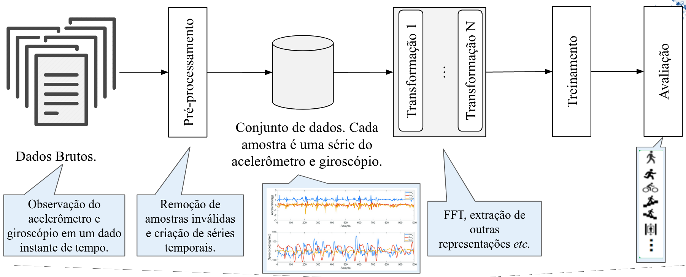

.. _overview:

==========================
Overview
==========================

Librep aims to define a common API for several ML projects.
In summary several ML workflows follows the some stages, shown in the above figure (specialized to Human Activity Recognition (HAR) worklows):

#. Pre-process raw data (steps 2) creating a CSV file (or other format, depending on the context).
#. Create a canonical data set (step 3), that is, a **dataset view**. From librep's perspective any processed data set subclass ``librep.base.data.Dataset`` class. An ``Dataset`` is a map-style data set and iterate over samples using Python's ``__getitem__`` method. If your dataset is a CSV file, that can be opened with Pandas, you can use ``librep.datasets.common.PandasMultiModalDataset`` to wrap around the ``Dataset`` class. Thus, every row will be a sample and have the corresponding label.
#. Several transformations can be done in samples of the data set (step 4). Every transformation must subclass ``librep.base.data.Transform`` class and implement ``fit`` and ``transform``methods. ``fit`` receives all samples in a data set and is used derive information about all samples (such as the mean and standard deviation of the data). ``transform`` is applied to a **single** sample of the data set. Classes such as ``librep.dataset.common.TransformMultiModalDataset`` helps to apply several transforms (in chain, as in Figure above) to all samples of the data set. This will generate an **Embedding**.
#. The embedded data set can be fit to a ML model (step 5). Every ML model, supervised, unsupervised or deep must subclass ``librep.base.estimator.Estimator`` class and implement the ``fit`` and ``predict`` methods. ``fit`` trains the model (``y`` parameter must be passed for supervised learning models and it is optional for unsupervised method) while ``predict`` will perform the prediction.
#. Results can be finally evaluated (step 6). The evaluators must override classes at ``librep.base.evaluator`` in order to evaluate a model, accordingly to the problem. Usually, evaluations will return a dict with results, or plot an image, or write some information to a file.

Librep API was designed with the following principles:

* Be a flexible API, in order to be easily to expand it.
* Match well known APIs such as Pytorch and scikit-learn.
* Handle large data sets, those that does not fit in RAM memory.
* Allows performing parallel and distributed computations.
* Easy integration with cloud environments, such as Amazon SageMaker.
* Easily create units tests and using continuous integration tools.

Directory Structure
---------------------

The librep package directory is organized as follows:

* ``base``: contains all base classes that must be sub classed to implement different librep's functionalities.
* ``config``: some system configuration and diagnostic output.
* ``datasets``: tools for generating data set views (CSV files), wrappers around ``librep.base.data.Dataset`` class for data sets, and tools for generating synthetic data.
* ``estimators``: estimators implementing the ``librep.base.estimator.Estimator`` interface. Scikit learn estimators already implement this interface. Also, there are wrappers to Pytorch and tensorflow models around ``librep.base.estimator.Estimator`` interface.
* ``losses``: classes defining loss functions, which follow the pattern of ``torch.nn.modules.loss``. Implement common losses from HAR papers and implementations.
* ``metrics``: defines metric tracking types, used for deep learning models.
* ``transforms``: transformations implementing the ``librep.base.data.Transform`` interface.
* ``utils``: utilitary functions.
* ``workflow``: tools for represent the workflow pipeline as an Directed Acyclic Graph (DAG) and tools for executing this graph (sequentially, parallel, distributed, or in cloud). This interface is not well defined yet and should not be used for now.

Design Decisions
---------------------

- The ``transform`` method is applyied to a single sample. It is supposed that this sample will already be processed (*e.g.*, reshaped) accordingly.
